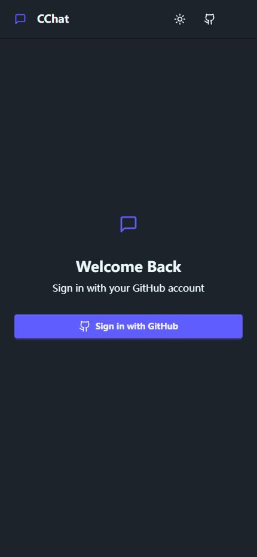
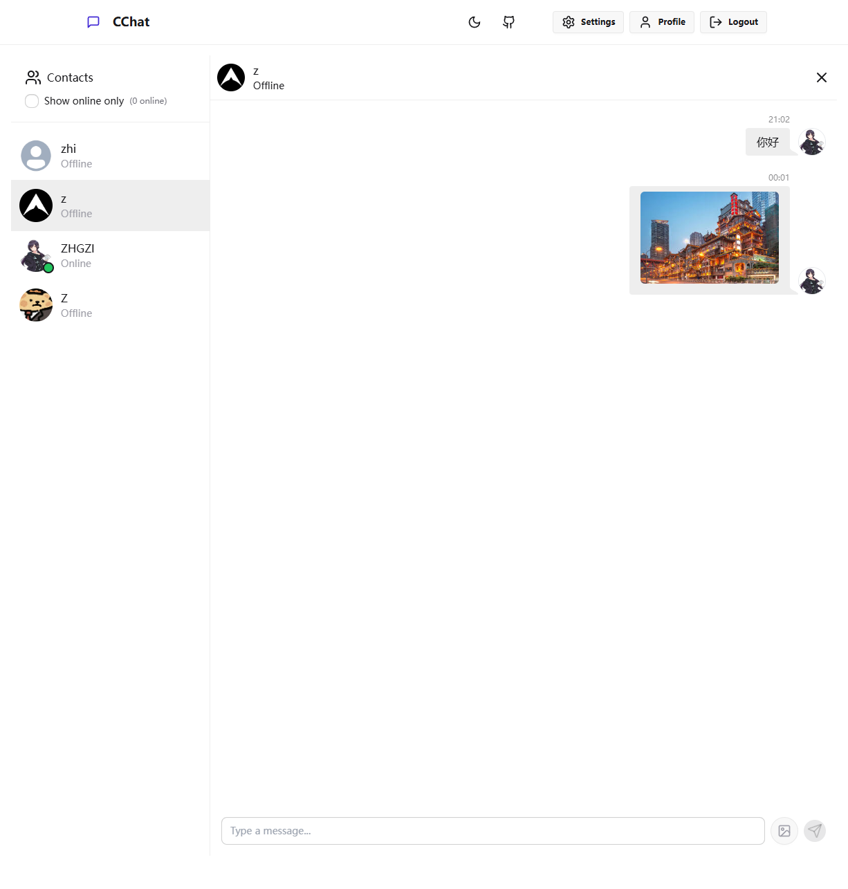

# CChat - Real-time Chat Application

[中文](readme_CN.md)

<a name="English"></a>

## 🌍 English Version

### 🚀 Introduction

CChat is a modern real-time chat application built with the MERN stack (MongoDB, Express, React, Node.js), featuring:
- 🔒 GitHub OAuth authentication
- 💬 Socket.io for real-time communication
- 🎨 Dual theme support (Light/Dark)
- 👥 Online user presence tracking
- 📱 Responsive design with daisyUI

### ✨ Key Features

- **Secure Login**: GitHub OAuth 2.0 authentication
- **Real-time Chat**: Instant message delivery
- **Theme Switching**: Toggle between light/dark modes
- **Online Status**: Real-time user presence indicators
- **Message History**: Persistent chat storage
- **Responsive UI**: Works on all device sizes

### 🛠 Tech Stack

| Category       | Technologies                  |
|----------------|-------------------------------|
| Frontend       | React, Vite, daisyUI, Socket.io Client |
| Backend        | Node.js, Express, Socket.io   |
| Database       | MongoDB                       |
| Authentication | GitHub OAuth, JWT             |
| Styling        | Tailwind CSS                  |

### ⚙️ Installation

1. Clone repository

```bash
git clone https://github.com/yourusername/cchat.git
```

2. Install dependencies

```bash
cd CChat && npm run build 
```

3. Create .env file
```bash
# ====== BACKEND ======
# ====== Normal ======
MONGODB_URI=
retryWrites=
PORT=
JWT_SECRET=
CLOUDINARY_CLOUD_NAME=
CLOUDINARY_API_KEY=
CLOUDINARY_API_SECRET=
GITHUB_CLIENT_ID=
GITHUB_CLIENT_SECRET=

# ====== DEv ====== 
#NODE_ENV=
#GITHUB_CALLBACK_URL=
#FRONTEND_URL=

# ====== Prod ====== 
NODE_ENV=production
GITHUB_CALLBACK_URL=
FRONTEND_URL=


# ====== FRONTED ======
#dev
#VITE_API_BASE_URL=
#VITE_SOCKET_BASE_URL=

#prod
VITE_API_BASE_URL=
VITE_SOCKET_BASE_URL=

#normal
VITE_GITHUB_DOCS_URL=

VITE_PRODUCT_NAME=
```

4. Start development

```bash
# Start backend
npm run dev

# Start frontend
cd client && npm run dev
```

### 🚀 deployment

plz view nginx.conf file to see how to deploy this project on nginx server and deploy it on your own server. Or u can use render or vercel to deploy this project.

### 📸 Screenshots



